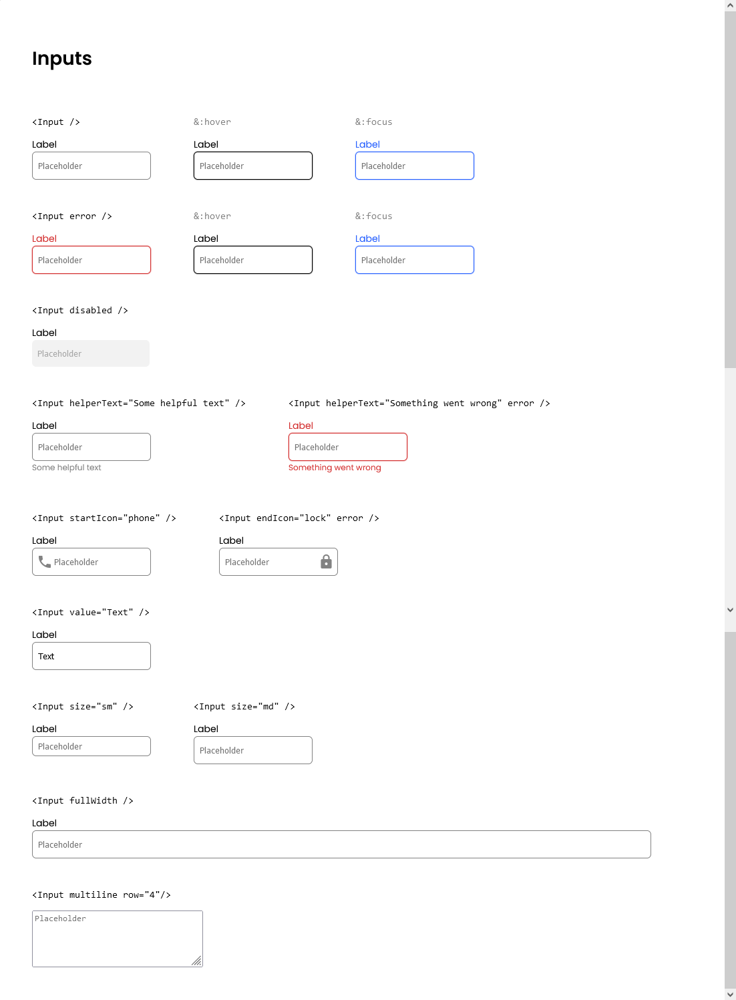

<!-- Please update value in the {}  -->

<h1 align="center">Input Component</h1>

<div align="center">
   Solution for a challenge from  <a href="http://devchallenges.io" target="_blank">Devchallenges.io</a>.
</div>

<div align="center">
  <h3>
    <a href="https://https://app.netlify.com/sites/candid-licorice-300439">
      Demo
    </a>
    <span> | </span>
    <a href="https://https://github.com/yuandere/input-component">
      Solution
    </a>
    <span> | </span>
    <a href="https://devchallenges.io/challenges/TSqutYM4c5WtluM7QzGp">
      Challenge
    </a>
  </h3>
</div>

<!-- OVERVIEW -->

## Overview



This is a simple React input component with display and options for helper text, input size, icons and more!

### Features
- **Size**: small, medium, full container width
- **Colors**: error, hover, focus
- **Icons**: inserted on the left/right side of input field using material icons
- **Helper Text**: easily add additional context info

### Built With

<!-- This section should list any major frameworks that you built your project using. Here are a few examples.-->

- [React](https://reactjs.org/)
- [Create React App](https://create-react-app.dev/)
- [SASS](https://sass-lang.com/)
- [Material Icons](https://fonts.google.com/icons?selected=Material+Icons)
## How To Use

<!-- Example:  -->

To clone and run this application, you'll need [Git](https://git-scm.com) and [Node.js](https://nodejs.org/en/download/) (which comes with [npm](http://npmjs.com)) installed on your computer. From your command line:

```bash
# Clone this repository
$ git clone https://github.com/your-user-name/your-project-name

# Install dependencies
$ npm install

# Run the app
$ npm start
```

Adjust styles to your preference in Buttons.scss or .css.
If using Buttons.scss be sure to use a [SASS compiler](https://marketplace.visualstudio.com/items?itemName=glenn2223.live-sass) to update changes.
## Acknowledgements

<!-- This section should list any articles or add-ons/plugins that helps you to complete the project. This is optional but it will help you in the future. For exmpale -->

- [Steps to replicate a design with only HTML and CSS](https://devchallenges-blogs.web.app/how-to-replicate-design/)

## Contact

- GitHub [@yuandere](https://{github.com/yuandere})
- Discord [@al doub#7487](https://{discord.com})